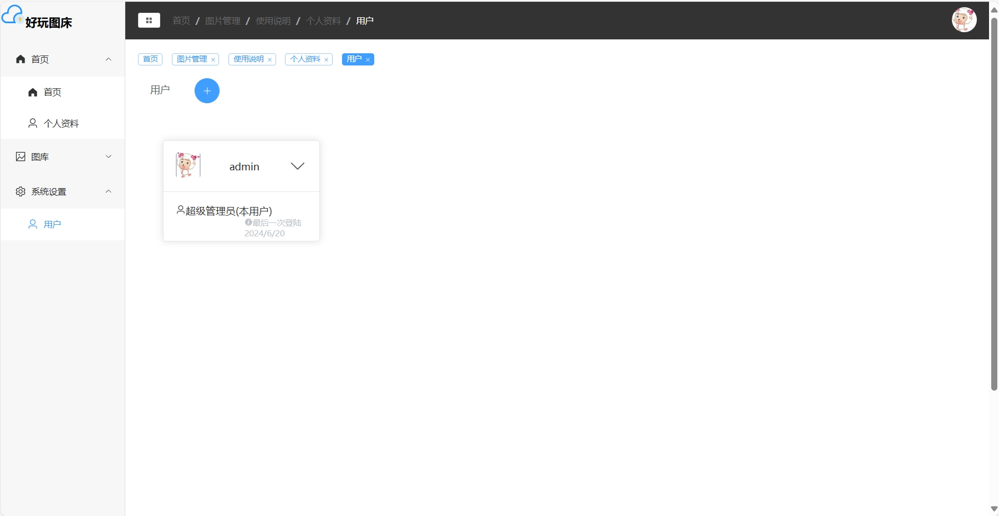
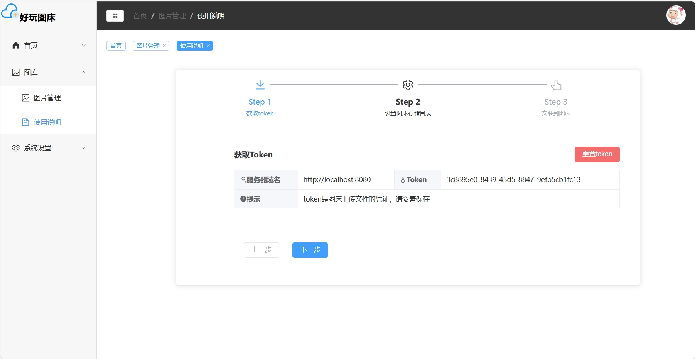

# image-manage 分布式图床
<div align="center">
  
</div>


图像管理应用提供了一个方便管理图片的平台，支持单机和Kubernetes集群部署。请确保您至少拥有一个MySQL数据库和一个Redis数据库，以及一个至少为Kubernetes 1.29版本的集群（如果选择集群部署）。

[文档及更多信息](https://wnzzer.github.io/image-manage/)

# 项目页展示

## 1.首页

<div align="center">
  
</div>

## 2. 用户管理

<div align="center">
  
</div>

## 3. token管理
<div align="center">
  
</div>

## 4. 图片在线管理页
<div align="center">
  
</div>
<div align="center">
  
</div>

## 本地调试

### 1. 后端配置
1. git 源代码
```shell
git clone https://github.com/wnzzer/image-manage.git
```
2. 配置 mysql 和 redis 数据库
修改 application-test.yml 里的数据源
在 mysql 中创建 image-manage 数据库
运行项目中的 `image-manage.sql`文件

3. 在 idea 中激活或者 test 配置文件并运行
### 2. 前端配置
1. 切换到 font-userui 文件夹
2. 安装依赖
``` shell
npm i
```
3. 修改后端端口地址
> 修改public目录里的 config.json,本地调试改为`localhost:8080` 即可


## 注意⚠️

1. 需要至少一个MySQL数据库
2. 需要至少一个Redis数据库
3. 如果采用集群部署，需要一个版本至少为Kubernetes 1.29的集群

## 单机部署（Docker）

使用Docker拉取并运行image-manage：

```bash
docker run -p 8080:8080 \
 -v 你的数据目录:/app\
 -e CONFIG_ISCLUSTERMODEENABLED=false \
 -e SPRING_DATASOURCE_URL=jdbc:mysql://192.168.0.254:3306/image_manage?useUnicode=true&characterEncoding=utf-8&useSSL=false&serverTimezone=Asia/Shanghai \
 -e SPRING_DATASOURCE_USERNAME=root \
 -e SPRING_DATASOURCE_PASSWORD=123456 \
 -e SPRING_REDIS_HOST=192.168.0.254 \
 -e SPRING_REDIS_PASSWORD=123456 \
 wnzzer/image-manage:latest
```
> 仓库地址： <https://github.com/wnzzer/image-manage>

  </code-block>
</code-group>

### 提示
- 由于Spring Boot的配置替换策略，可以根据需要替换更多的Spring Boot参数配置。


## 集群部署部署(k8s)‘

### 前置要求


- 安装metrics server，以支持应用监控资源。如果没有该组件，Kubernetes metrics API将无法工作，image-manage也将无法收集Pod资源信息。

```sh
kubectl apply -f https://github.com/kubernetes-sigs/metrics-server/releases/latest/download/components.yaml
```

### 部署image-manage

```sh
wget  https://github.com/wnzzer/image-manage/releases/latest/download/image-manage-yaml
```
```yaml
apiVersion: v1
kind: Namespace
metadata:
  name: image-manage


kubectl apply -f image-manage.yaml
```


  >1. 这里同样需要把redis，mysql修改成自己的配置
  >2. 这里需要有自己的pv供应器，由于是pv动态创建，所以需要搭配自动供应器给statusfulSet创建pv，示例中使用的是nfs
  >3. image-manage 需要搭配 k8s 配置进行对k8s api的访问，这里实例使用的是admin.conf,使用configmap挂载到容器里，如果想要更细致的权限划分，请将权限配置至少给予 image-manage级别的权限。
  >4. 创建的k8s用户文件请将命名为admin.conf,因为应用里指定了k8s配置文件为admin.conf，其他名称会无法读取。


## 访问

我们可以直接在k8s中部署nginx，反代 image-manage cluster ip，进行访问，

## 前端部署
1. 打包文件
```shell
npm run build
```
2. 将部署到 static 后端 static目录；
或者使用nginx分离部署均可

>由于接口配置地址在 public/config.json，部署前后修改都可以，修改为后端地址或者域名